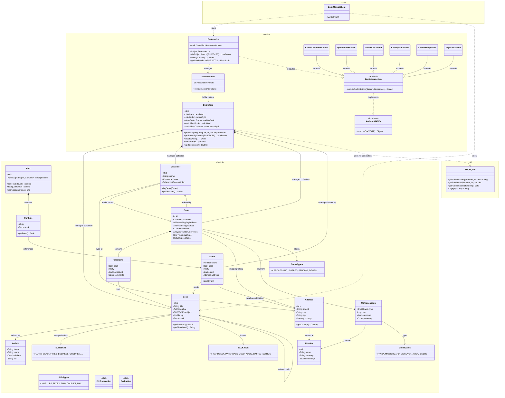

# BookMarketCore

## Diagrama de Classes

```mermaid
classDiagram
    %% --- PACOTE CLIENT ---
    namespace client {
        class BookMarketClient {
            +main(String[])
        }
    }

    %% --- PACOTE UTIL ---
    namespace util {
        class TPCW_Util {
            +getRandomString(Random, int, int) String
            +getRandomInt(Random, int, int) int
            +getRandomDate(Random) Date
            +DigSyl(int, int) String
        }
    }

    %% --- PACOTE DOMINIO (ENTIDADES) ---
    namespace dominio {
        class BACKINGS { <<enumeration>> HARDBACK, PAPERBACK, USED, AUDIO, LIMITED_EDITION }
        class CreditCards { <<enumeration>> VISA, MASTERCARD, DISCOVER, AMEX, DINERS }
        class ShipTypes { <<enumeration>> AIR, UPS, FEDEX, SHIP, COURIER, MAIL }
        class StatusTypes { <<enumeration>> PROCESSING, SHIPPED, PENDING, DENIED }
        class SUBJECTS { <<enumeration>> ARTS, BIOGRAPHIES, BUSINESS, CHILDREN, ... }

        class Address {
            -int id
            -String street1
            -String city
            -String zip
            -Country country
            +getCountry() Country
        }

        class Author {
            -String fname
            -String lname
            -Date birthdate
            -String bio
        }

        class Book {
            -int id
            -String title
            -Author author
            -SUBJECTS subject
            -double srp
            -Stock stock
            +getRelated1() Book
            +getThumbnail() String
        }

        class Cart {
            -int id
            -HashMap~Integer, CartLine~ linesByBookId
            +subTotal(double) double
            +total(Customer) double
            +increaseLine(Stock, int)
        }

        class CartLine {
            -int qty
            -Stock stock
            +getBook() Book
        }

        class Country {
            -int id
            -String name
            -String currency
            -double exchange
        }

        class CCTransaction {
            -CreditCards type
            -long num
            -double amount
            -Country country
        }

        class Customer {
            -int id
            -String uname
            -Address address
            -Order mostRecentOrder
            +logOrder(Order)
            +getDiscount() double
        }

        class Order {
            -int id
            -Customer customer
            -Address shippingAddress
            -Address billingAddress
            -CCTransaction cc
            -ArrayList~OrderLine~ lines
            -ShipTypes shipType
            -StatusTypes status
        }

        class OrderLine {
            -Book book
            -int qty
            -double discount
            -String comments
        }

        class Stock {
            -int idBookstore
            -Book book
            -int qty
            -double cost
            -Address address
            +addQty(int)
        }

        class PixTransaction { <<Stub>> }
        class Evaluation { <<Stub>> }
    }

    %% --- PACOTE SERVICO ---
    namespace servico {
        class Bookstore {
            -int id
            -List~Cart~ cartsById
            -List~Order~ ordersById
            -Map~Book, Stock~ stockByBook
            -static List~Book~ booksById
            -static List~Customer~ customersById
            +populate(long, long, int, int, int, int) boolean
            +getBooksBySubject(SUBJECTS) List~Book~
            +createOrder(...) Order
            +confirmBuy(...) Order
            +updateStock(int, double)
        }

        class Bookmarket {
            -static StateMachine stateMachine
            +init(int, Bookstore...)
            +doSubjectSearch(SUBJECTS) List~Book~
            +doBuyConfirm(...) Order
            +getNewProducts(SUBJECTS) List~Book~
        }

        class StateMachine {
            -List~Bookstore~ state
            +execute(Action) Object
        }

        class Action~STATE~ {
            <<interface>>
            +executeOn(STATE) Object
        }
        
        class BookstoreAction {
            <<abstract>>
            +executeOnBookstore(Stream~Bookstore~) Object
        }
        
        %% Command Pattern Classes (Inner classes of Bookmarket)
        class CreateCustomerAction
        class UpdateBookAction
        class CreateCartAction
        class CartUpdateAction
        class ConfirmBuyAction
        class PopulateAction
    }

    %% --- RELACIONAMENTOS GERAIS ---

    %% Dependencias do Cliente
    BookMarketClient ..> Bookmarket : uses
    BookMarketClient ..> Book : uses

    %% Relacionamentos do Dominio
    Book --> Author : written by
    Book --> SUBJECTS : categorized as
    Book --> BACKINGS : format
    Book --> Book : related books

    Cart *-- CartLine : contains
    CartLine --> Stock : references

    Order *-- OrderLine : contains
    Order --> Customer : ordered by
    Order --> Address : shipping/billing
    Order --> CCTransaction : payment
    Order --> StatusTypes : status

    OrderLine --> Book : item

    Customer --> Address : lives at
    Customer --> Order : tracks recent

    Address --> Country : located in
    CCTransaction --> Country : location
    CCTransaction --> CreditCards : type

    Stock --> Book : stocks
    Stock --> Address : warehouse location

    %% Relacionamentos de Serviço
    Bookmarket --> StateMachine : manages
    StateMachine --> Bookstore : holds state of

    Bookstore *-- Book : manages collection
    Bookstore *-- Customer : manages collection
    Bookstore *-- Order : manages collection
    Bookstore *-- Stock : manages inventory

    Bookstore ..> TPCW_Util : uses for generation

    %% Command Pattern Hierarchy
    BookstoreAction ..|> Action : implements
    CreateCustomerAction --|> BookstoreAction : extends
    UpdateBookAction --|> BookstoreAction : extends
    CreateCartAction --|> BookstoreAction : extends
    CartUpdateAction --|> BookstoreAction : extends
    ConfirmBuyAction --|> BookstoreAction : extends
    PopulateAction --|> BookstoreAction : extends
    
    Bookmarket ..> BookstoreAction : executes
```

