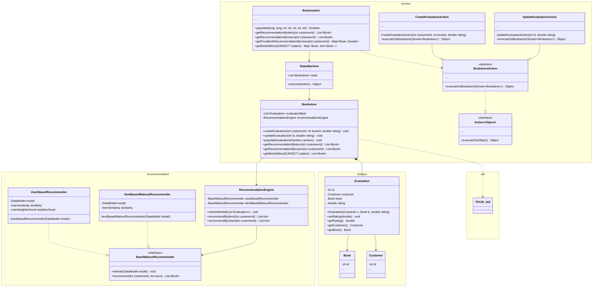

# BookMarketCore

## Coders manifest
- Code development and comments use English language
- Commit messages should use the [Conventional Commits](https://www.conventionalcommits.org/en/v1.0.0/) standard
- Commits should be done to feature branches `ft/` and only then, through a PR are merged to the `master` branch
- Configure and execute linters on IDE before commiting changes
- PRs are reviewed by an opposite squad

## Class Diagram
This class diagram represents the overall changes made by consequence of the implementation of the Recommender system.
This diagram's purpose is not to be 100% complete, but to map only the required interfaces to be changed.

